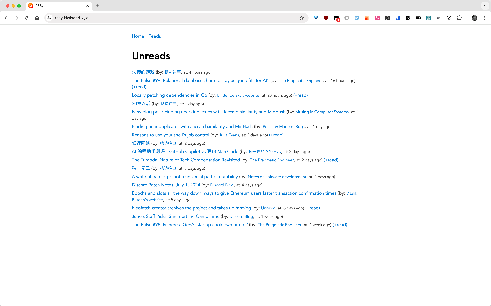
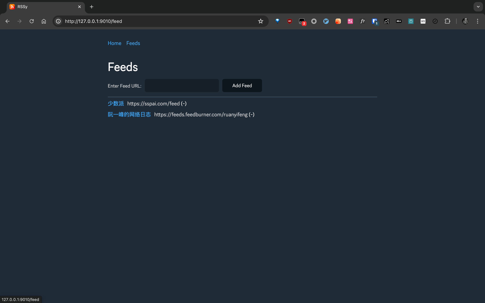
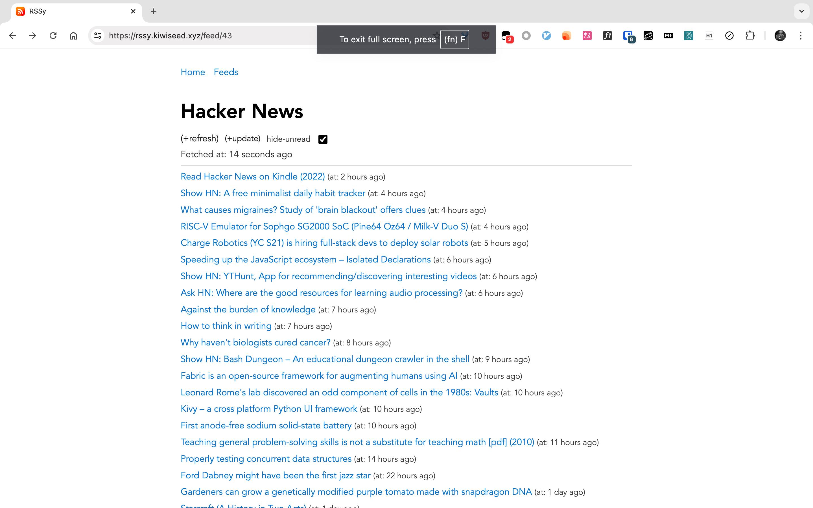

# RSSy

`RSS` + `y` = `RSSy`

`RSSy` is a RSS management site build by `Go` + `Template` + `GitHub OAuth`.

- Support `Import` `opml` file, and `Export` feeds to `opml`
- Using `Github OAuth`
- Support `Sqlite3` and `Postgres` by `Gorm`
- Clean and modern design
- Customize config for echo feed(hide at unread, send to kindle(comming soon))

## Run
add needed environment variables.
- `DB`: `sqlite3` path or `postgres` url
- `SITE_URL`: site url, used for oauth redirect
- `GH_CLIENT_ID`: github client id
- `GH_SECRET`: github client secret
- `PORT`: server port, default `8080`
- `PG`: use `postgres` or not, default use `sqlite3`

then run
```shell
go run main.go
```

## Deploy with docker
> Dockerfile auto generated by [abcdlsj//nestg](https://github.com/abcdlsj/share/tree/master/go/nestg)

1. build image
```shell
docker build -t <imagename> .
```

1. Run with postgres
```shell
docker run -d --restart unless-stopped -e PG=true -e DB="<postgres url>" -e SITE_URL="https://example.com" -e GH_CLIENT_ID="xxxxx" -e GH_SECRET="xxxxx" -e PORT="8080" -p 19200:8080 <imagename>
```

1. Or Run with sqlite

can use `--mount type=bind,source=rssy.db,target=/rssy.db` to mount database.

remove `PG=true` environment variable.

```shell
docker run -d --restart unless-stopped -e DB="rssy.db" -e SITE_URL="https://example.com" -e GH_CLIENT_ID="xxxxx" -e GH_SECRET="xxxxx" -e PORT="8080" -p 19200:8080 --mount type=bind,source=rssy.db,target=/rssy.db <imagename>
```

## PNGs




