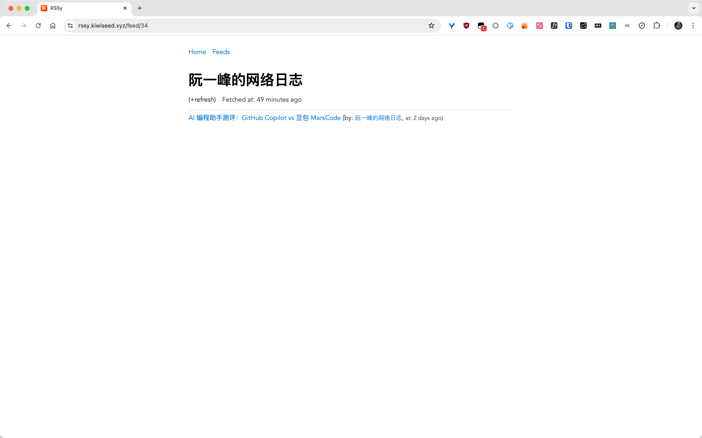

# RSSy

`RSS` + `y` = `RSSy`

`RSSy` is a RSS management site build by `Go` + `Template` + `GitHub OAuth`.

- Support `Import` `opml` file, and `Export` feeds to `opml`
- Using `Github OAuth`
- Support `Sqlite3` and `Postgres` by `Gorm`
- Clean and modern design

## PNGs

