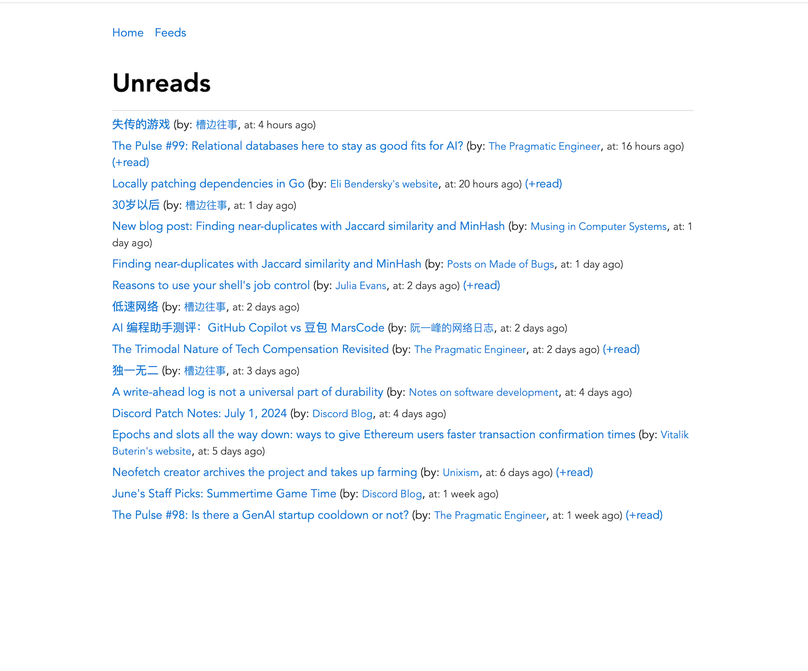
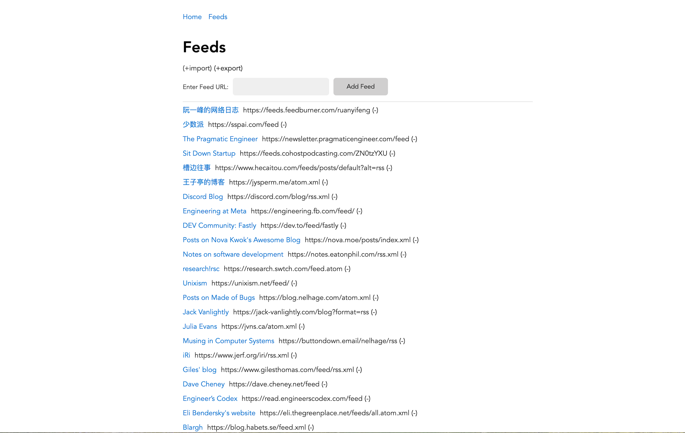
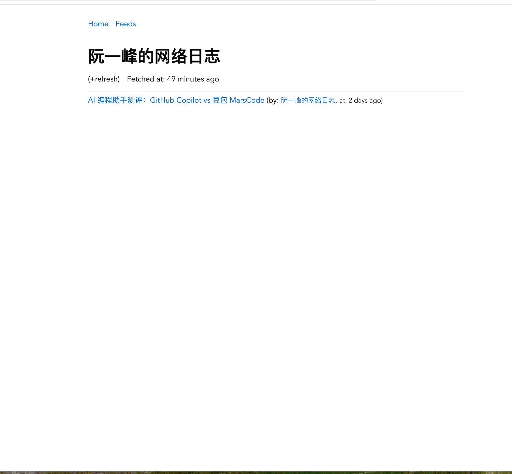
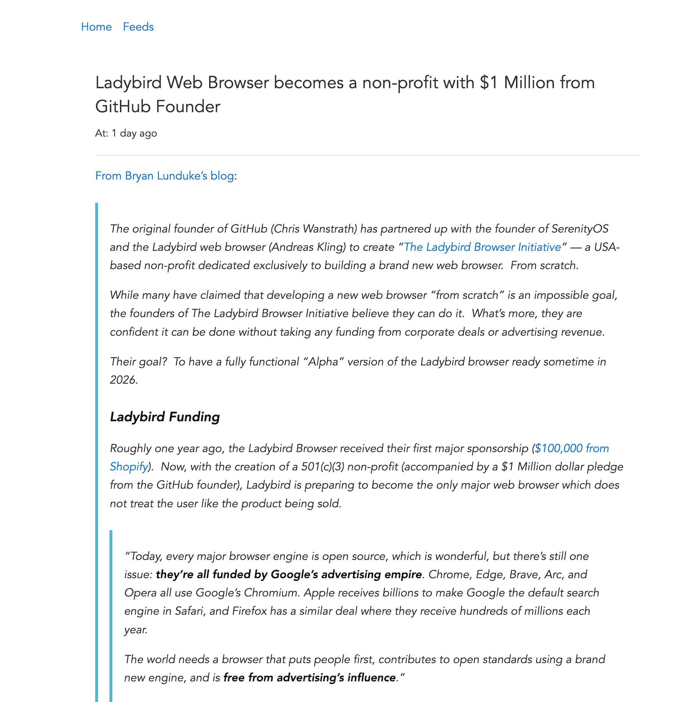
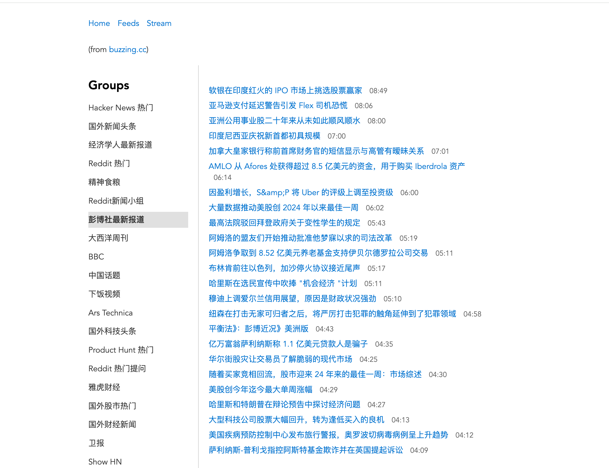

# RSSy

`RSS` + `y` = `RSSy`

`RSSy` is a RSS management site build by `Go` + `Template` + `GitHub OAuth`.

- Support `Import` `opml` file, and `Export` feeds to `opml`
- Using `Github OAuth`
- Support `Sqlite3` and `Postgres` by `Gorm`
- Clean and modern design
- Customize config for echo feed(hide at unread, send to kindle(comming soon))

## Run
add needed environment variables.
- `DB`: `sqlite3` path or `postgres` url
- `SITE_URL`: site url, used for oauth redirect
- `DEFAULT_EMAIL`: admin email. The user matching this email is the admin and can manage site-wide settings.
- `TRUSTED_AUTH_HEADER`: set `true` when running behind [Nexo](https://github.com/abcdlsj/nexo) or another
  reverse proxy that authenticates users and passes the identity in the `X-Auth-User` request header.
- `GH_CLIENT_ID`: github OAuth app client id
- `GH_SECRET`: github OAuth app client secret
- `CIPHER_KEY`: session encryption key (32 bytes). **Required when GitHub login is enabled**; keep it secret.
- `PORT`: server port, default `8080`
- `PG`: use `postgres` or not, default use `sqlite3`

then run
```shell
go run main.go
```

## Registration / multi-user

RSSy identifies users by GitHub account. Setting `GH_CLIENT_ID` and `GH_SECRET`
automatically opens registration: anyone with a GitHub account can log in at
`/login` and gets their own feeds, categories, preferences and articles on first
login. The admin (`DEFAULT_EMAIL`) can also enable/disable this in
`/preference` under "Admin Settings - Registration (GitHub Login)".

### Behind Nexo (recommended)

When RSSy is proxied by [Nexo](https://github.com/abcdlsj/nexo), let Nexo handle
the GitHub OAuth instead:

- Configure the RSSy proxy route with `auth: true` in Nexo and list the users you
  want to admit in Nexo's `auth.github.allowed_users`.
- Start RSSy with `TRUSTED_AUTH_HEADER=true`. RSSy then trusts Nexo's
  `X-Auth-User` header, creates an account on first visit for every allowed user,
  and no longer needs `GH_CLIENT_ID`, `GH_SECRET` or `CIPHER_KEY`.
- Set `DEFAULT_EMAIL` to `<your-github-username>@users.noreply.github.com` so you
  keep admin rights after the header is mapped to an email identity.
- Keep RSSy reachable only through Nexo (e.g. bind it to localhost/private
  network), because the header is trusted as-is.

Notes:

- Create the GitHub OAuth App with callback URL `<SITE_URL>/login/callback`.
- If a GitHub user has no public email, the account is identified by
  `<login>@users.noreply.github.com`; set `DEFAULT_EMAIL` accordingly if the
  admin uses a private GitHub email.
- Users can sign out via the `Logout` link in the navigation bar.
- Without `GH_CLIENT_ID`/`GH_SECRET` (or with registration disabled), the app
  stays in single-user mode and everyone is treated as `DEFAULT_EMAIL`.
- `DEBUG_MODE=true` skips OAuth entirely and forces single-user mode.

## Deploy with docker
> Dockerfile auto generated by [abcdlsj//nestg](https://github.com/abcdlsj/share/tree/master/go/nestg)

1. build image
```shell
docker build -t <imagename> .
```

1. Run with postgres
```shell
docker run -d --restart unless-stopped -e PG=true -e DB="<postgres url>" -e SITE_URL="https://example.com" -e DEFAULT_EMAIL="you@example.com" -e GH_CLIENT_ID="xxxxx" -e GH_SECRET="xxxxx" -e CIPHER_KEY="<32 byte random key>" -e PORT="8080" -p 19200:8080 <imagename>
```

1. Or Run with sqlite

can use `--mount type=bind,source=rssy.db,target=/rssy.db` to mount database.

remove `PG=true` environment variable.

```shell
docker run -d --restart unless-stopped -e DB="rssy.db" -e SITE_URL="https://example.com" -e DEFAULT_EMAIL="you@example.com" -e GH_CLIENT_ID="xxxxx" -e GH_SECRET="xxxxx" -e CIPHER_KEY="<32 byte random key>" -e PORT="8080" -p 19200:8080 --mount type=bind,source=rssy.db,target=/rssy.db <imagename>
```

## PNGs






